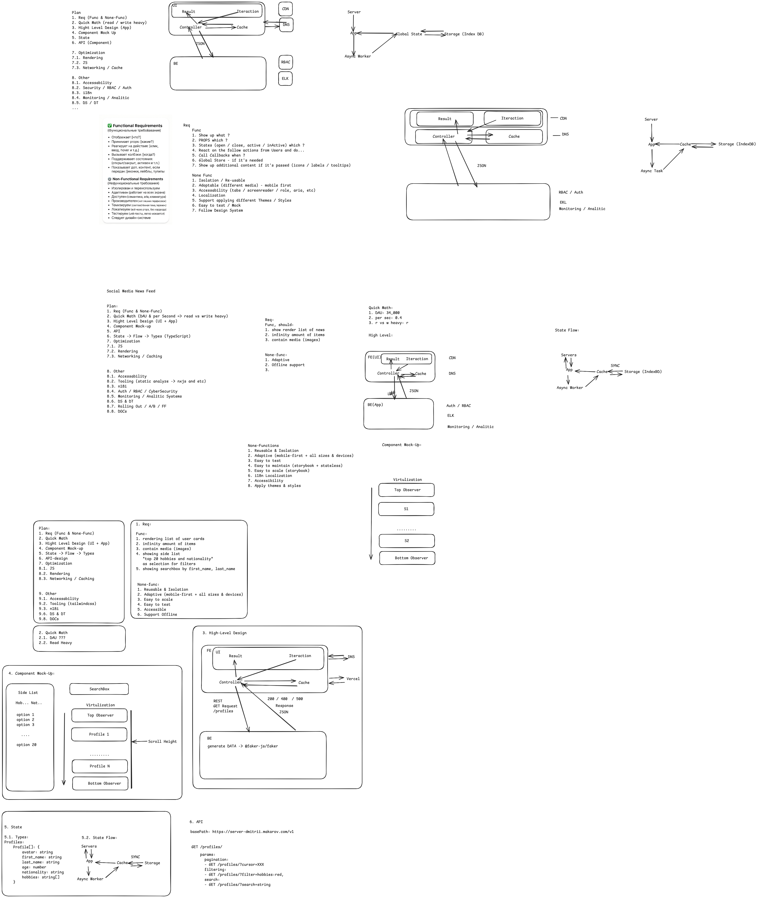

## Dmitrii Makarov's Project

A brief description of what the application does and its purpose.

---

## Table of Contents

- [Technologies](#technologies)
- [Installation](#installation)
- [Environment Setup](#environment-setup)
- [Running the Application](#running-the-application)
- [Access](#access)
- [Project Structure](#project-structure)
- [Scripts](#scripts)
- [Contributing](#contributing)
- [License](#license)
- [Next Steps / Improvements](#next-steps-improvements)

---

## Technologies

- Node.js
- Yarn
- Vite
- React

---

## Installation

1. Clone the repository:
   \`\`\`git clone git@github.com:DmitryMA/cautious-umbrella.git
   cd cautious-umbrella\`\`\`
2. Install dependencies:
   \`\`\`yarn\`\`\`

---

## Environment Setup

The application uses environment variables. In the \`client/\` directory, you will find example files:

- **\`.env.local.example\`** — template for local environment variables.  
  1. Rename \`client/.env.local.example\` to \`client/.env.local\`:     
  2. Edit variables if needed. Valid defaults are already provided in the example.

- **\`.env\`** — additional environment variables (optional).

> **Note:** Do not commit real secrets or sensitive data to version control.

---

## Running the Application

From the project root, run:

\`yarn start\`

The application will build and start automatically.

---

## Access

After starting, you will see in the console:

\`
🚀 Server running on http://localhost:3001
  VITE v6.3.2  ready in 1586 ms
  ➜  Local:   http://localhost:5173/
  ➜  Network: use --host to expose
  ➜  press h + enter to show help
\`

- **Frontend**: http://localhost:5173/  
- **Backend** (server): http://localhost:3001

---

## Project Structure

\`plaintext
/
├─ client/               # Frontend application
│  ├─ public/            # Static assets
│  ├─ src/               # Source code
│  ├─ .env.local.example # Env template for client
│  └─ ...
├─ server/               # Backend server (if any)
├─ package.json          # Scripts and dependencies
└─ ...
\`

---

## Scripts

- \`yarn start\` — install dependencies and start the application.  
- \`yarn build\` — create a production build (if configured).  
- \`yarn test\` — run tests (if any).

---

## License

Specify your project's license (e.g., MIT, Apache 2.0, etc.).

---

## Next Steps / Improvements

- Migrate the server to TypeScript  
- Add Storybook with Playwright smoke tests  
- Set up GitHub Actions or Vercel for deployment  
- Prepare production build configuration  
- Complete URL synchronization for filter support (not all cases covered)
