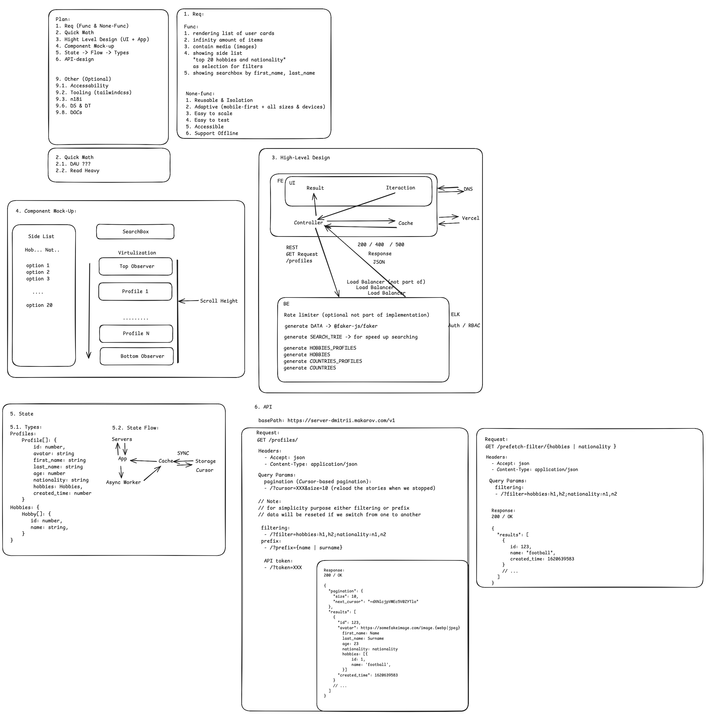

## Dmitrii Makarov's Project

### 🚀 Interactive Demo 


---

### 🧩 Architecture Overview



---

## Table of Contents

- [Technologies](#technologies)
- [Installation](#installation)
- [Environment Setup](#environment-setup)
- [Running the Application](#running-the-application)
- [Access](#access)
- [Project Structure](#project-structure)
- [Scripts](#scripts)
- [Contributing](#contributing)
- [License](#license)
- [Next Steps / Improvements](#next-steps-improvements)

---

## Technologies

### 🔹 Client-side (Frontend)
- **React 19** + **React DOM**
- **TypeScript**
- **Vite** — modern bundler and dev server
- **React Router v7** — routing
- **TanStack React Query** — data fetching & caching
- **TanStack React Virtual** — list virtualization
- **Tailwind CSS** — utility-first styling
- **React Content Loader** — skeleton loaders
- **ESLint + Prettier** — linting & formatting
- **Storybook** *(planned)*
- **GitHub Actions CI** *(planned)*

### 🔸 Server-side (Backend)
- **Node.js + Express 5**
- **WebSocket (ws)** — real-time updates
- **CORS + dotenv** — configuration & security
- **faker.js** — mock data generation
- **Nodemon** — auto-restarting server during development

### 🧩 Monorepo Management
- **Lerna** — managing `client` and `server` packages in a monorepo

---

## Installation

1. Clone the repository:
   ```git clone git@github.com:DmitryMA/cautious-umbrella.git```
   ```cd cautious-umbrella```
2. Install dependencies:
   ```yarn```

---

## Environment Setup

The application uses environment variables. In the ```client``` directory, you will find example files:

- **```.env.local.example```** — template for local environment variables.  
  1. Rename ```client/.env.local.example``` to ```client/.env.local```:     
  2. Edit variables if needed. Valid defaults are already provided in the example.

- **```.env```** — additional environment variables (optional).

> **Note:** Do not commit real secrets or sensitive data to version control.

---

## Running the Application

From the project root, run:

```yarn start```

The application will build and start automatically.

---

## Access

After starting, you will see in the console:

```
🚀 Server running on http://localhost:3001
  VITE v6.3.2  ready in 1586 ms
  ➜  Local:   http://localhost:5173/
  ➜  Network: use --host to expose
  ➜  press h + enter to show help
```

- **Frontend**: http://localhost:5173/  
- **Backend** (server): http://localhost:3001

---

## Project Structure

```plaintext
/
├─ client/               # Frontend application
│  ├─ public/            # Static assets
│  ├─ src/               # Source code
│  ├─ .env.local.example # Env template for client
│  └─ ...
├─ server/               # Backend server (if any)
├─ package.json          # Scripts and dependencies
└─ ...
```

---

## Scripts

### Server (in the `server` folder)
| Command       | Description                                 |
| ------------- | ------------------------------------------- |
| `yarn start`  | Start the server: `node index.js`           |
| `yarn dev`    | Start the server in development mode using `nodemon` |

### Client (in the `client` folder)
| Command        | Description                                                                 |
| -------------- | --------------------------------------------------------------------------- |
| `yarn dev`     | Run the client in development mode with Vite                                |
| `yarn start`   | Alias for `yarn dev` – starts the Vite dev server                          |
| `yarn build`   | Build for production: first `tsc -b`, then `vite build`                     |
| `yarn preview` | Preview the production build locally via `vite preview`                     |
| `yarn lint`    | Run ESLint on all project files                                             |
| `yarn format`  | Format code with Prettier (`src/**/*.{js,jsx,ts,tsx,json,css,md}`)          |

---

## License

Specify your project's license (e.g., MIT, Apache 2.0, etc.).

---

## Next Steps / Improvements

1. Implement token support for secure backend data access  
2. Write unit tests  
3. Set up GitHub Actions or Vercel for deployment  
4. Prepare production build configuration  
5. API documentation (Swagger/OpenAPI)  
6. Logging and monitoring with Grafana  
7. Add Storybook with Playwright smoke tests  
8. Complete URL synchronization for filter support (not all cases covered)  
9. Accessibility checks  
10. Internationalization (i18n)  
11. Migrate the server to TypeScript  

